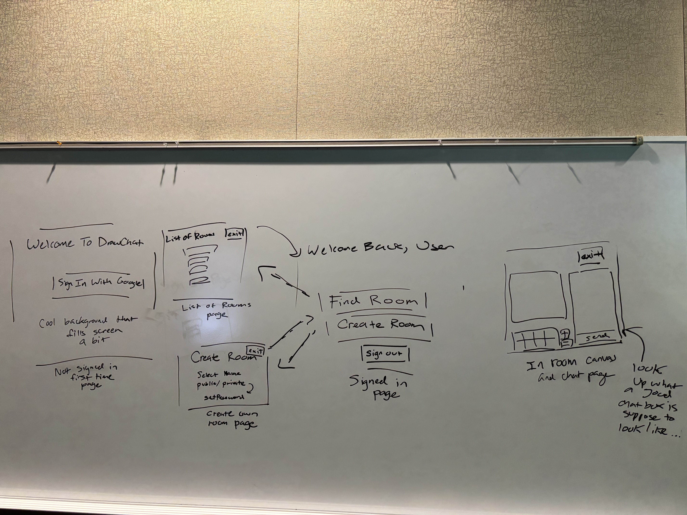

# Draw Chat

## Things that we need to work on
1. Right now we have a database set up, but we need to get past the **login page** to get it to work
2. We need to set up the database with users so that if you enter a username and password that is in the page you can be **authenticated**
3. After this, we need to define the rest of the tables of the database that need to be made, **Users**, **Posts**, **CanvasScreen?**, not really sure

### Current Progress / Notes
- Right now trying to set up the supabase postgres server, but i cannot run the drizzle command (from the drizzle ORM)

## As of April 5, 2025:
After work assessment:
- I still want to make the landing page look cooler, but maybe
save that until the end
- I should disable the need for google login right now, supabase
is fucking awful
- VERY MUCH NEED TO FIX design of canvas

- God damn it has been a while, got to be more consistent.
- Acutal feedback: I want the front page to be more visually appealing, right now it is ass
- Want to add UI stuff for the canvas
- Am very interested to figure out an algorithmic way to make the drawing work smoother

## As of March 19, 2025:

## As of March 12, 2025:
- We kinda got a "stylish" button, but I still want to make it more visually appealing. Also, we need to do the same thing for the log out button, and then fix the visuals of the actual
drawing place.

## As of March 11, 2025:
- I want to get a custom google login button to work nicely with the styling of the page!

## As of Feburary 21, 2025 
- So far, I have gotten google authentication to work, so I wanna get a drawing board and draw out how I want the app to look like.
- Major two aspects that need to get working are:
1. ChatRooms (ability to join a room)
2. The Chat itself (can send and recieve messages live through sockets)
3. The Canvas (ability to clear, increase and decrease pen size, and change the color)
4. If we have more time, we can figure out to do login page

## I should draw out what I want the chat rooms, Sign Page, and Canvas + ChatRoom to look like!
